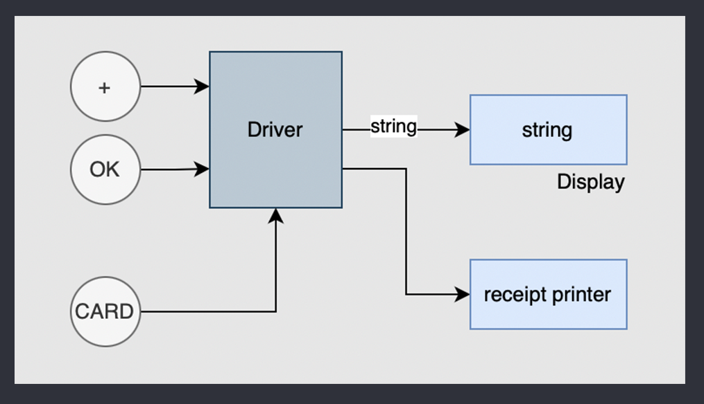
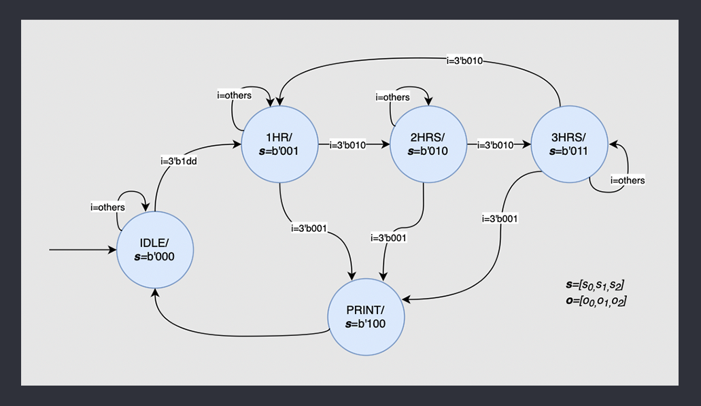
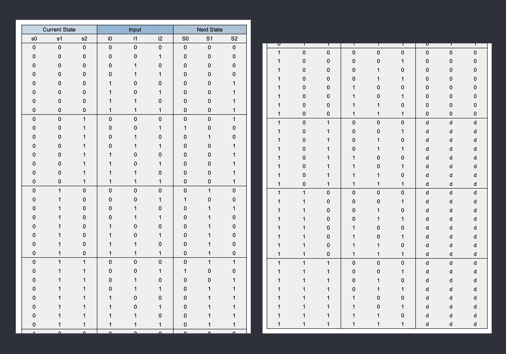
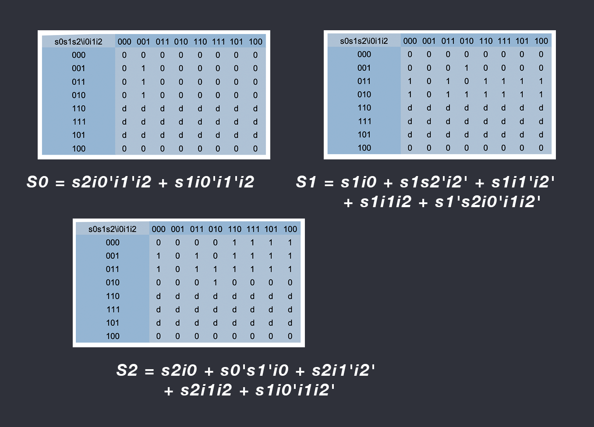
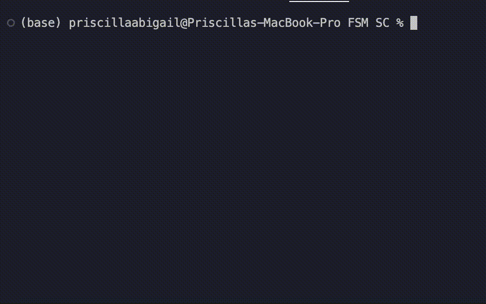

# Parking Meter with Finite State Machine  🚙

In this repository, I built a <b>parking meter system</b> using <b>Finite State Machine</b> and implemented the system using <b>C</b>. 

## Description

This parking meter system is capable of<b> reading the identity of a car</b>,<b> its license plate</b>, <b>its records</b>,<b> its parking time</b>, as well as<b> receiving the duration</b> picked by the user in which the car will be parked. 

## Block Diagram

Based on the description above, there are threee inputs, which are:

- button '+',
- button 'ok', and
- a signal that emulates an event coming from a card reader. (it will send a signal (one) if a card is tapped)

These signals are processed by a driver that will be modeled by an FSM depicted in the next section. 
The driver will send a string to a display and a receipt printer. 
The block diagram of the system is depicted below.



## State Diagram

This parking meter has 5 states which are <b>Idle</b>, <b>1 Hr</b>, <b> 2 Hrs</b>, <b>3 Hrs</b>, and <b>Print</b>. The <i>Idle</i> state of the parking meter system indicates that the system is not being used and is waiting for a signal from the card reader. The <i>1 Hr</i>, <i>2 Hrs</i>, and <i>3 Hrs</i> states each represents the options which users can choose between. And lastly the <i>Printing</i> state indicates that the parking meter system is printing the receipt.



## Encoding

Below is the list of mapping of the state names and their encoded bits.

```
- IDLE --> 3'b000
- 1HR --> 3'b001
- 2HR --> 3'b010
- 3HR --> 3'b011
- PRINT --> 3'b100
```

For the inputs, they are represented by a 3x1 vector whose elements are i0, i1, and i2. i0 represents a signal coming from the card reader, i1 represents a signal from the button '+', and i2 represents a signal from the button 'OK'.


## Truth table

Based on the state diagram and the encoding previously explained, we can determine the truth table.



## Karnaugh Maps and the Boolean Equations

To figure out how the present state bits, input bits, and next state bits are related, we use multiple Karnaugh maps based on the aforementioned truth table. The Boolean equations are written below the tables.




## Instructions to run

Follow these steps to run and test out the code:

1. Download the zip folder containing all of the files of this repository.
2. Open the files in your chosen IDE.
3. In the terminal, type the command -> ``` make ```


